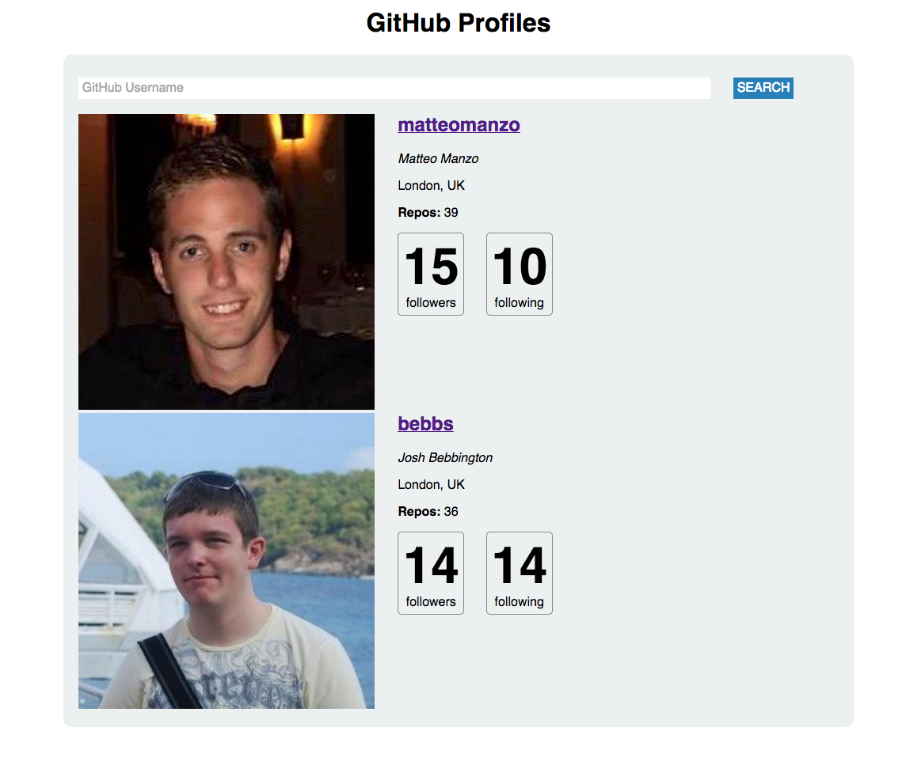

# Node Github API
**Makers Academy Week 7 project**: Github API in Node

<section align='center'>
  
</section>

An exploration of creating servers in Node, grabbing data from the Github API, and serving it to the page in HTML & CSS.

This was my first experience of creating a server in Node. After 'reps' of creating a plain Express.js server, I felt confident enough to start pulling in data. Node's asynchronous, non-blocking nature meant that we had to manage the data as it was streamed to us, rather than make a single `get` request. 

As an example, for each 'chunk' of data that was returned from Github, we had to append it to all previous chunks before attempting to parse it. 

```
var str = '';

res.on('data', function(chunk) {
  str += chunk;
});
```

##Technologies used
| Languages   | Frameworks  | Testing  |
| ------------|-------------| -----|
| JavaScript  | Node        | Mocha-casperjs |
| HTML        | Express.js  | Phantomjs|
| CSS         |    |  |

##Collaborators

[Josh Bebbington](https://github.com/bebbs) and [Matteo Manzo](https://github.com/matteomanzo) of the December '14 cohort at [Makers Academy](https://www.makersacademy.com)

##How to run
Clone the repository and change into the directory:
```
$ git clone https://github.com/bebbs/node_github_api.git
$ cd node_github_api
```

Install the dependencies listed in the package.json 
```
npm install
```

Run the Gruntfile to 
```
grunt
```

Start the server using `node server.js`, then visit http://localhost:9999 to view the application

